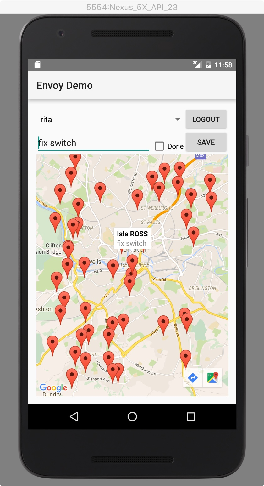

# EnvoyDemo
Demo Android app for https://github.com/cloudant-labs/envoy

This app demonstrates efficient two-way replication adopting a "one database per user" design pattern.

The screenshots above demonstrate a hypothetical set of tasks for a field service engineer to complete, as displayed on a map view. Each screenshot shows a different user's view. The user can login or logout (authentication is not considered here), view their tasks, and make edits to the `Description` or `Done` fields. Upon logout, their changes will be pushed to the Cloudant server, via Envoy.

Most importantly, the user sees only the tasks assigned to them, even though the app uses the same backend URL (which points to a running instance of Envoy). By changing the username and password in the basic authentication headers sent to Envoy, a different set of tasks is retrieved via pull replication.

# Coming Soon
Instructions on how to set up and run the demo app.
